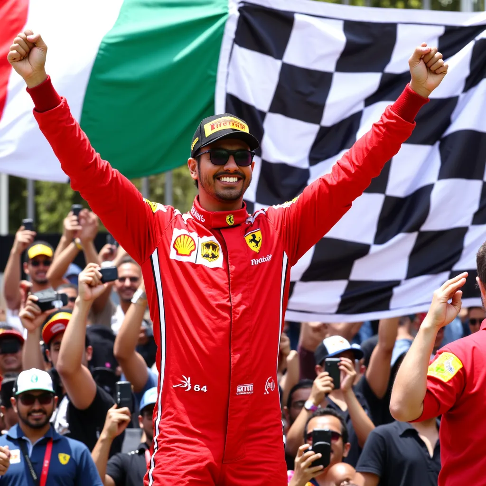
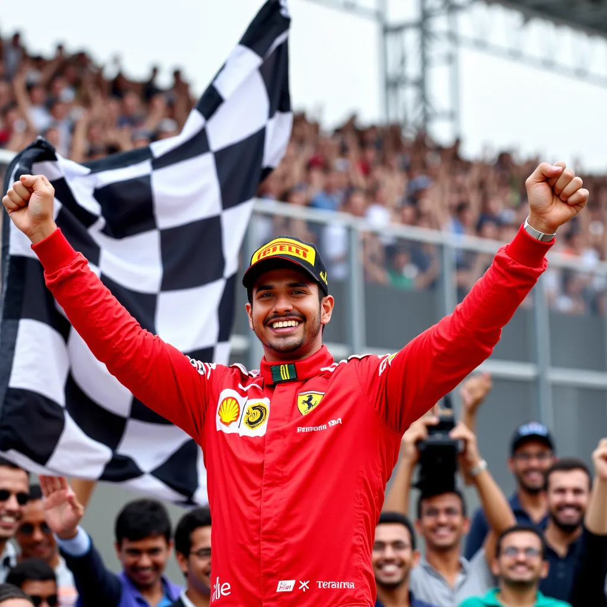

# Hari's Image Generation App

This Streamlit app generates AI images featuring Hari within a specified scene. It uses Gemini for prompt modification and Replicate for image generation.

## Features

* **Prompt Modification with Gemini:**  Takes a user-provided prompt and modifies it using Gemini to seamlessly integrate Hari into the scene.  Ensures Hari is visible and actively participating.
* **Image Generation with Replicate:** Leverages a custom Replicate model (`harikrishnad1997/flux-1-hari-ft:37b22168a51d814b49bc8629cca6caaa6789a8a7b65cdd5123310fe5a5c5fecc`) fine-tuned to include Hari.
* **Customizable Settings:** Allows users to adjust the number of inference steps, guidance scale, and number of output images.
* **Image Display and Download:** Displays the generated images within the app and provides download links.
* **Error Handling:** Includes error handling for missing dependencies, API keys, and image loading failures.

## Installation

1. **Clone the repository:**

```bash
git clone [https://github.com/harikrishnad1997/FLUX-1-Finetuning/tree/main](https://www.google.com/search?q=https://github.com/harikrishnad1997/FLUX-1-Finetuning/tree/main)  
cd YOUR_REPOSITORY_NAME
```

2. **Create a virtual environment (recommended):**

```bash
python3 -m venv .venv
source .venv/bin/activate  
```

3. **Install the required packages:**

```bash
pip install -r requirements.txt
```

1. **Set up API Keys:**

* **Replicate API Token:**  Obtain your Replicate API token from your Replicate account settings and set it as an environment variable `REPLICATE_API_TOKEN` or in the Streamlit secrets file (`.streamlit/secrets.toml`).  Example in `.streamlit/secrets.toml`:

```toml
REPLICATE_API_TOKEN="YOUR_REPLICATE_API_TOKEN"
GEMINI_API_KEY="YOUR_GEMINI_API_KEY"
```

* **Gemini API Key:** Obtain your Gemini API key and set it as an environment variable `GEMINI_API_KEY` or in the Streamlit secrets file (`.streamlit/secrets.toml`).

## Usage

1. **Run the Streamlit app:**

```bash
streamlit run app.py  
```

2. **Enter a prompt:** In the app, enter a description of the scene you want to generate.

3. **Adjust settings (optional):** Use the advanced settings to customize the image generation process.

4. **Generate images:** Click the "Generate Images" button.

5. **View and download:** The generated images will be displayed. You can download them using the provided links.

## Example

1. User enters the prompt: "Winning the Italian GP as a Ferrari Driver"
2. The app, using Gemini, modifies the prompt to something like: "Hari, a Ferrari driver, celebrates victory at the Italian Grand Prix, the checkered flag waving behind him as he raises his arms in triumph on the podium, surrounded by cheering fans."
3. The app uses the modified prompt to generate images with the Replicate model.
4. The generated images, showing Hari in the Tokyo market, are displayed to the user.

| Image 1 | Image 2 |
|---|---|
| [](assets/example1.png) | [](assets/example2.png) |
| Image 3 | Image 4 |
| [](assets/example1.png) | [](assets/example4.png) |


## License

This project is licensed under the [MIT License](LICENSE).